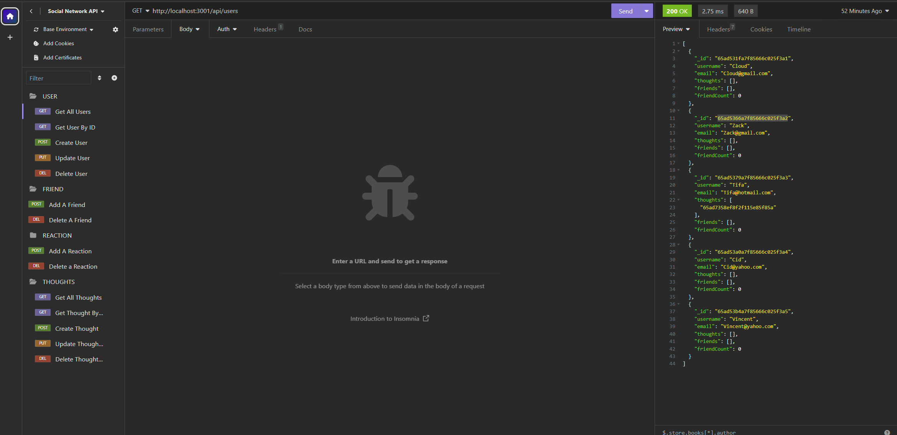
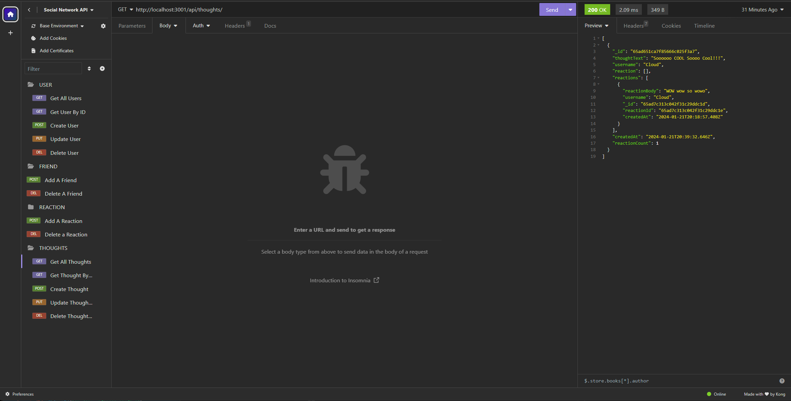
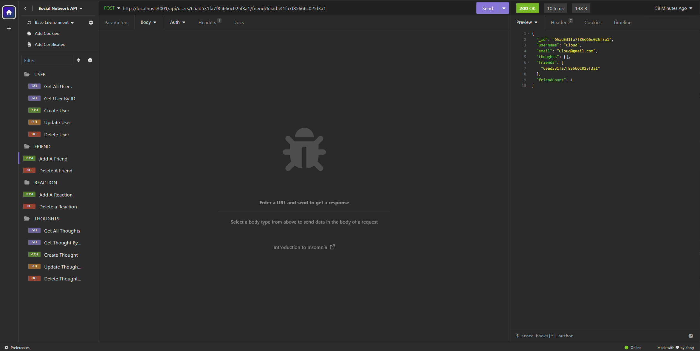
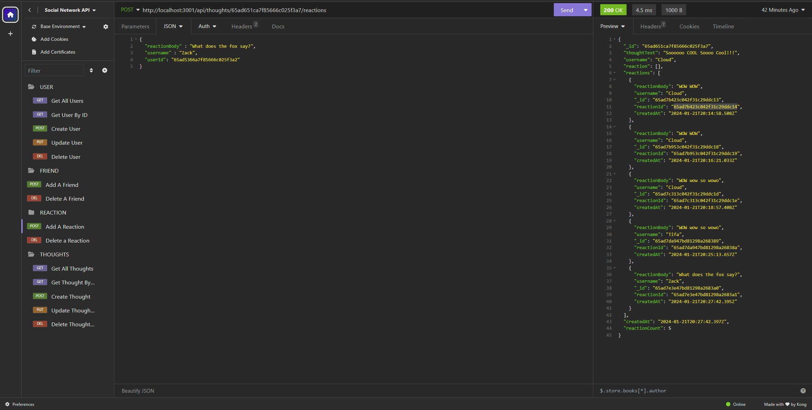

# Module 18 Challenge: NoSQL Social Network API

<p align="center">
  
</p>

## Description

Was task on creating a social network platform that would allow users to post their thoughts. Add friends, and reaction to other user thoughts.

## Screen Shots
* Get All User


* Get All Thought


* Add Friend


* Add Reaction


 Click on the link to watch a video demonstration: 
[Social Network API Video Demo]( https://drive.google.com/file/d/1A2ia9wEHiw3RpEwM2z6MV8ycYj1XSRRI/view)

## Table of Contents
1. [Installation](#installation)
2. [Technologies](#technologies)
3. [Usage](#usage)
4. [Tests](#tests)
5. [Contribution](#contribution)
6. [License](#license)
7. [Contact](#contact)

## Installation
Make sure that you have Node.js install, if you do not have node.js, you can visit [Node.js website](https://nodejs.org/en).

You will also need to add dependencies, in your terminal type in:

```
npm init
```
```
npm express
```
```
npm mongoose
```

## Technologies

<p align="center">
  
  
  
  
  
  
</p>

## Usage

Make sure you have MongoDB Compass. If you do not have MongoDB you can you visit [MongoDB website](https://www.mongodb.com/try/download/community).

Also make sure that you have Insomnia so that you can run the testing. If you do not have Insomnia you can visit [Insomnia website](https://insomnia.rest/download).

## Tests

All testing was done through Insomnia using HTTP methods OF GET, POST, PUT, AND DELETE

## Contribution

Created for Module 18 Challenge of the U of M full stack boot camp.

## License

This project is licensed under the MIT License.

## Contact

 * Email: xiongxeng@gmail.com
 * Github: http://github.com/freeway9527

